# Data Pipeline: Reconstruire les activités depuis le cache Strava

## Flow Diagram

```mermaid
flowchart TD
    Start([User clicks 'Reconstruire les activités<br/>depuis le cache Strava']) --> ProgressInit[Initialize Progress UI<br/>Status Container + Progress Bar]
    
    ProgressInit --> LoadExisting[Load existing activities.csv<br/>to preserve non-cached activities]
    
    LoadExisting --> ScanCache{Scan raw_strava_dir<br/>for *.json files}
    
    ScanCache -->|For each JSON file| ReadJSON[Read JSON file<br/>Extract activity details]
    
    ReadJSON --> CheckTS{Check if<br/>timeseries exists}
    
    CheckTS -->|Yes| ComputeLaps[Compute lap metrics<br/>LapMetricsService.compute_and_store]
    CheckTS -->|No| MapRow
    
    ComputeLaps --> MapRow[Map activity row<br/>_map_activity_row]
    
    MapRow --> CollectID[Collect activity_id]
    
    CollectID -->|More files?| ScanCache
    CollectID -->|All processed| Merge[Merge cache activities<br/>with existing activities<br/>Filter by athlete_id]
    
    Merge --> WriteActivities[Write merged activities<br/>to activities.csv]
    
    WriteActivities --> ClearMetricsTS[Clear metrics_ts files<br/>for rebuilt activities]
    
    ClearMetricsTS --> RecomputeMetrics1[Recompute activity metrics<br/>MetricsComputationService<br/>Includes hrSpeedShift computation]
    
    RecomputeMetrics1 --> LoadActivities[Load all activities<br/>for athlete_id]
    
    LoadActivities --> FilterTS[Filter activities<br/>with hasTimeseries=True<br/>and timeseries file exists]
    
    FilterTS --> CountTotal[Count total activities<br/>with timeseries]
    
    CountTotal --> LoopStart{For each activity<br/>with timeseries}
    
    LoopStart -->|Current activity| UpdateProgress[Update Progress Bar<br/>progress_callback<br/>idx/total, activity_name]
    
    UpdateProgress --> ClearTSFile[Clear metrics_ts file<br/>if exists]
    
    ClearTSFile --> ProcessTS[Process Timeseries<br/>SpeedProfileService.process_timeseries]
    
    ProcessTS --> Preprocess1[Preprocess Timeseries<br/>- Moving averages lat/lon<br/>- Compute distance<br/>- Compute speed<br/>- Or use paceKmh if no GPS]
    
    Preprocess1 --> ComputeShift[Compute HR-Speed Shift<br/>Find best offset for correlation]
    
    ComputeShift --> FilterHR[Filter HR > 120<br/>Apply smoothing]
    
    FilterHR --> Cluster[KMeans Clustering<br/>n_clusters from config default:5<br/>HR vs Speed correlation]
    
    Cluster --> SaveMetricsTS[Save metrics_ts<br/>hr_smooth, speed_smooth<br/>hr_shifted, clusters]
    
    SaveMetricsTS -->|More activities?| LoopStart
    SaveMetricsTS -->|All processed| RecomputeMetrics2[Recompute all metrics<br/>for all activities<br/>Daily/Weekly aggregates]
    
    RecomputeMetrics2 --> UpdateUI[Update UI<br/>Progress: 100%<br/>Status: Complete]
    
    UpdateUI --> End([Return list of<br/>rebuilt activity IDs])
    
    style Start fill:#e1f5ff
    style End fill:#c8e6c9
    style UpdateProgress fill:#fff9c4
    style ProcessTS fill:#ffccbc
    style Cluster fill:#f3e5f5
    style RecomputeMetrics1 fill:#e1bee7
    style RecomputeMetrics2 fill:#e1bee7
```

## Detailed Steps

### Phase 1: Data Loading & Preservation
- **Input**: Existing `activities.csv`, `data/raw/strava/*.json` files
- **Action**: Load existing activities to preserve those not in cache
- **Output**: List of existing activity IDs

### Phase 2: Cache Reconstruction
- **Input**: Raw JSON files from Strava cache
- **Process**: 
  - Parse each JSON file
  - Extract activity details (distance, time, elevation, HR, etc.)
  - Check if timeseries CSV exists
  - Compute lap metrics if applicable
  - Map to activities.csv row format
- **Output**: List of rebuilt activity rows

### Phase 3: Merging & Persistence
- **Input**: Rebuilt activities + Existing activities
- **Process**: 
  - Merge lists (preserve existing activities not in cache)
  - Filter by athlete_id
  - Write to `activities.csv`
- **Output**: Updated `activities.csv` file

### Phase 4: Metrics Clearance
- **Input**: List of rebuilt activity IDs
- **Action**: Delete existing `metrics_ts/{activityId}.csv` files
- **Output**: Cleared metrics_ts directory for rebuilt activities

### Phase 5: Activity Metrics Recomputation
- **Input**: Rebuilt activity IDs
- **Process**: 
  - Load timeseries for each activity
  - Compute HR-speed shift (if timeseries available)
  - Compute distance-equivalent, TRIMP, etc.
  - Update `activities_metrics.csv`
- **Output**: Updated `activities_metrics.csv` with `hrSpeedShift`

### Phase 6: Timeseries Metrics Processing (with Progress)
- **Input**: All activities with timeseries for athlete
- **Process** (for each activity):
  1. **Preprocessing**:
     - GPS-based: Moving averages on lat/lon → distance → speed
     - Fallback: Use paceKmh directly if no GPS
  2. **HR-Speed Correlation**:
     - Find optimal offset (-60 to +60 seconds)
     - Maximize correlation between HR and speed
  3. **Filtering**:
     - Filter HR > 120 bpm
     - Apply smoothing (10-point moving average)
  4. **Clustering**:
     - KMeans clustering on HR vs Speed
     - Use `n_cluster` from config (default: 5)
     - Map clusters back to full dataframe
  5. **Persistence**:
     - Save to `metrics_ts/{activityId}.csv`
     - Columns: hr_smooth, speed_smooth, hr_shifted, cluster
- **Output**: Updated `metrics_ts` directory with precomputed data

### Phase 7: Final Metrics Recomputation
- **Input**: All activity IDs for athlete
- **Process**: 
  - Recompute daily metrics (aggregates by date)
  - Recompute weekly metrics (aggregates by week)
  - Update rolling windows (acute/chronic load)
- **Output**: Updated `daily_metrics.csv` and `weekly_metrics.csv`

## Key Files & Directories

- **Input Data**:
  - `data/raw/strava/*.json` - Raw Strava activity data
  - `data/timeseries/{activityId}.csv` - Timeseries streams
  - `activities.csv` - Existing activities (preserved)

- **Output Data**:
  - `activities.csv` - Rebuilt activities (merged)
  - `activities_metrics.csv` - Updated metrics including `hrSpeedShift`
  - `metrics_ts/{activityId}.csv` - Precomputed HR/Speed/cluster data
  - `daily_metrics.csv` - Daily aggregates
  - `weekly_metrics.csv` - Weekly aggregates

## Progress Tracking

The pipeline includes real-time progress updates:
- Progress bar shows: `current/total` activities processed
- Status text shows: Current activity name being processed
- Updates occur before each metrics_ts processing step

## Error Handling

- Each step has try/except blocks
- Failed activities are logged but don't stop the process
- Existing data is preserved if errors occur
