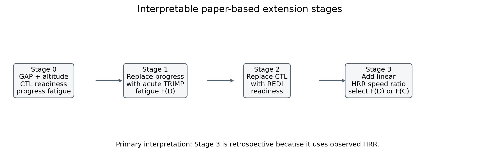
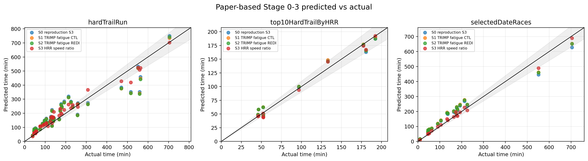
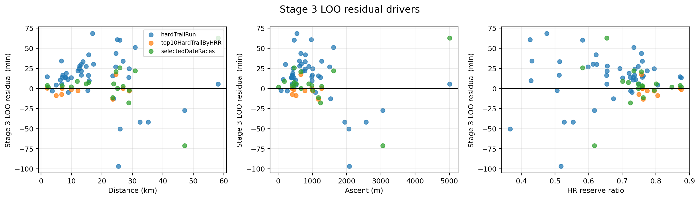
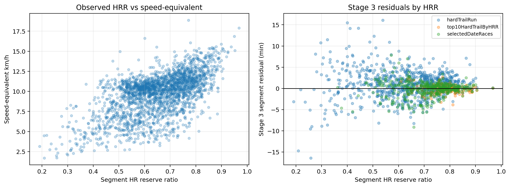
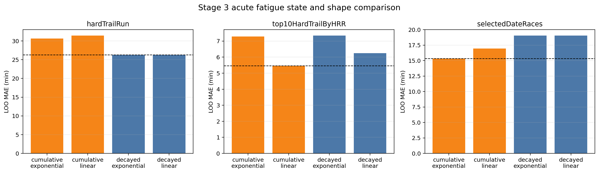
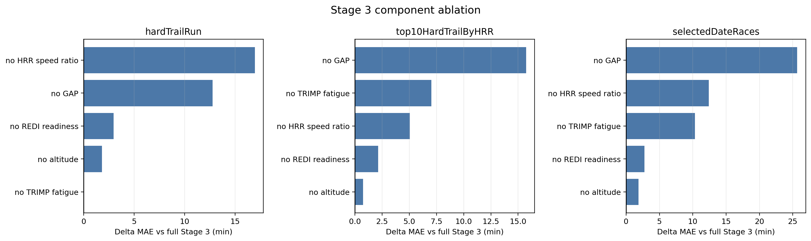
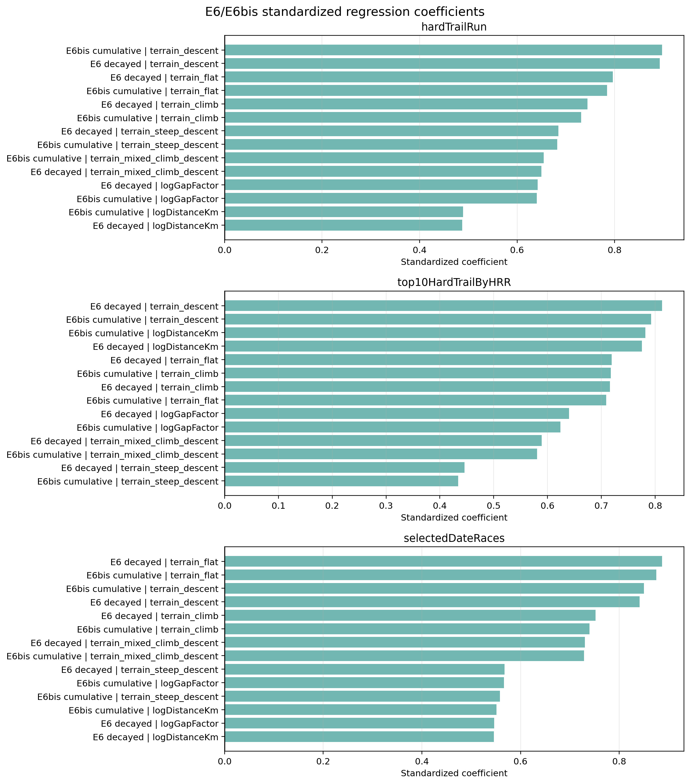
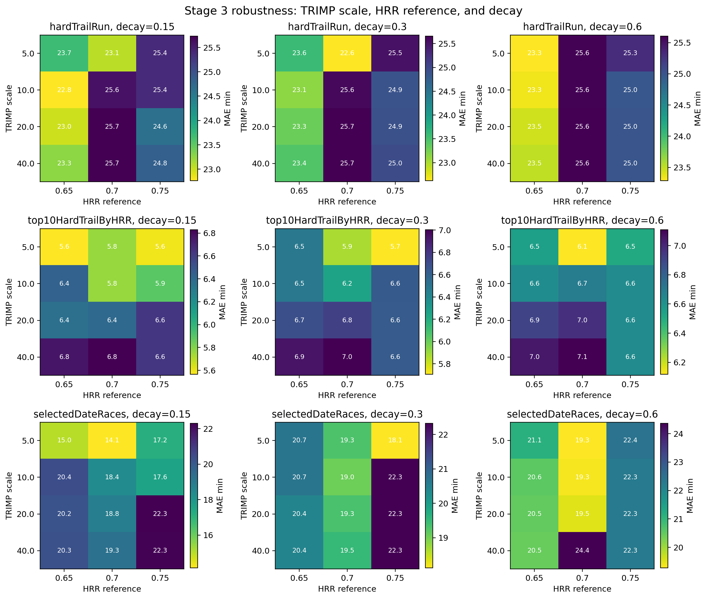

# Extending a Physics-Based Trail-Running Digital Twin with Heart-Rate Reserve and Acute Training Impulse: A Single-Athlete Sport Data Science Case Study

**Manuscript type:** draft full paper for a sport data science / sport technology journal or conference.

**Primary venue fit:** Journal of Sports Analytics.

**Fallback venue fit:** Frontiers in Sports and Active Living.

**Newer focused draft (2026-07):** `trail_digital_twin_hr_performance_paper_draft.md` + `bibliography_hr_digital_twin.md` — one modeling family, LOO/prospective errors, missing elements, venues **excluding Sensors**.

**§7 implementation status:** `docs/science/section7_implementation_status.md` + run `uv run python scripts/trail_digital_twin_paper_section7.py`.


## Point of vigilance
- The test on race profil with uniform HRR should a decreasing of time while HRR increase even until excessive HRR that seems impossible to maintain. The fatigue model may be a problem.
- U_scale or any reference scale are not calibrated to test.
## Abstract

Trail-running performance depends on route geometry, altitude, athlete readiness, and in-race effort. A recent Sensors trail-running digital twin proposes a physics-based race-time model using grade-adjusted pace, altitude correction, training-load readiness, and progressive pacing decay. That formulation is most natural for race-like maximal efforts. In a longitudinal repository of personal training and racing data, however, many trail activities are submaximal, and observed heart rate provides direct evidence about the effort level used on each route segment. This study reproduces the Sensors-style model on hard trail runs and evaluates an interpretable extension that replaces progress-based decay with acute in-activity TRIMP, replaces CTL readiness with REDI readiness, and adds a fixed heart-rate reserve (HRR) speed-ratio term. Three cohorts were evaluated: all hard trail runs (`n=45`), the top 10 hard trail runs by average HRR, and a selected-date race-like cohort (`n=18`). The primary validation was leave-one-activity-out cross-validation at activity level.

The reproduction Stage 3 model generalized well on the top-10 high-HRR cohort (LOO MAE 8.4 min, R2 0.967) but less well on all hard trail runs (LOO MAE 48.9 min, R2 0.843), consistent with a maximal-effort model being applied to heterogeneous training efforts. Replacing progress fatigue with acute TRIMP gave modest improvements. REDI readiness helped in the top-10 HRR cohort but was not universally better than CTL. The HRR speed-ratio extension was the dominant interpretable improvement: LOO MAE fell from 48.9 to 26.3 min on all hard trail runs, from 8.4 to 5.5 min on the top-10 HRR cohort, and from 41.6 to 15.3 min on selected-date races. With integrated GAP, the preferred acute fatigue state was cohort-dependent: decayed TRIMP on the full hard-trail cohort, cumulative TRIMP on the high-HRR and selected-date cohorts. A full segment-level log-time regression and HR-only baselines achieved lower errors in some cohorts, but these comparators are less physiologically constrained and more exposed to correlated-segment overfit. The proposed Stage 3 extension should therefore be interpreted as a retrospective, effort-adjusted performance indicator rather than a pre-race forecast.

**Keywords:** trail running; digital twin; grade-adjusted pace; heart-rate reserve; TRIMP; REDI; training load; single-athlete modeling; sport data science.

## Technical Summary

**Main result.** The HRR speed-ratio term is the clearest extension to the Sensors-style trail-running digital twin. It converts the model from a route-and-readiness predictor into a retrospective effort-adjusted performance model. On the full hard-trail cohort, LOO MAE improves from 48.9 min at reproduction Stage 0 to 26.3 min at Stage 3. On the selected-date cohort, LOO MAE improves from 41.6 to 15.3 min.

**Interpretation.** GAP remains essential because terrain cost is the dominant physical correction, while HRR captures whether the activity was near race effort. Acute TRIMP fatigue is physiologically plausible, but the best leakage-free state is not universal: decayed TRIMP fits the heterogeneous hard-trail cohort, while cumulative TRIMP fits the high-HRR and selected race-like cohorts better. REDI readiness is useful in the high-HRR subset but not stable enough to replace CTL across all cohorts.

**Caution.** Stage 3 uses observed HRR from the evaluated activity. It is not a pre-race forecast available before the start. It is better described as an effort-normalized performance indicator: "How fast was this run relative to route physics, readiness, and the effort actually observed?"
Still it can be use to predict future performance if the athlete can estimate their expected HRR on the route. In particular, it can be used to estimate the best usage of the HRR over time to get the best time on a given route. The model is not yet validated on other athletes, and the current TRIMP fatigue term is scale-sensitive and not yet robustly calibrated.


**Data policy.** The manuscript assets include anonymized derived activity and segment features only. They exclude raw Strava IDs, exact dates, names, coordinates, and timestamps. Weather is restricted to first-party Strava fields or reviewed cache fields; Enduraw-derived information is explicitly excluded.

## 1. Introduction

Trail-running time is not explained by distance alone. Grade modifies the metabolic cost of running, downhill segments can be mechanically limiting, altitude reduces aerobic power, and the same route can be run at very different effort levels depending on training intent, fatigue, and environmental context. A trail-running "digital twin" is attractive because it can combine route physics and athlete state into an interpretable prediction of expected completion time.

The Sensors 2026 trail-running digital twin provides a compact reference structure for this problem. It estimates segment time from distance, grade-adjusted cost, altitude correction, chronic training-load readiness, and a pacing-decay term fitted at race level. In the original proof-of-concept, 13 race sessions were calibrated and validated, with leave-one-out performance of R2 = 0.864, MAE = 18.2 min, and MAPE = 11.1%. The model is interpretable and appropriate for race-like efforts, especially when the calibration set contains competition performances from a consistent athlete.

The repository studied here is different. It contains a single athlete's longitudinal trail and running activities, including races, hard training runs, and submaximal outings. In this setting, the core modeling challenge is not only route cost. It is also effort heterogeneity. A runner can cover the same route slowly because the path is technical, because training load is high, because the route occurs at altitude or heat, or simply because the workout was intentionally easy. Heart-rate reserve (HRR) is therefore not merely a covariate; it is an observed effort signal that can separate low performance from low effort.

This paper asks four practical questions:

1. Can the Sensors-style physics model be reproduced on repository trail-running data?
2. Can acute in-activity TRIMP replace progress-based fatigue without breaking the paper-like speed equation?
3. Does REDI readiness improve over a classic CTL/ATL-style readiness factor?
4. Does a fixed HRR speed-ratio term explain submaximal effort better than route-only physics while remaining more interpretable than full regression?

The contribution is not a prediction leaderboard. It is a staged, auditable extension of a physics-based trail-running digital twin for single-athlete sport data science.

## 2. Related Work

The baseline model is the Sensors trail-running digital twin by Jaen-Carrillo and Pattis (2026), "A Physics-Based Digital Twin for Trail Running Race Performance Prediction: A Proof-of-Concept Study", which combines race segmentation, grade-adjusted speed, altitude correction, training-load effects, and pacing decay in a calibrated digital twin framework. The grade-adjustment component follows the long tradition of energetic cost models for locomotion on slopes, particularly Minetti et al.'s measurements of walking and running cost across steep uphill and downhill gradients.

Heart-rate reserve is used because it approximates relative cardiovascular effort better than raw heart rate when resting and maximal heart rates are known. HRR and oxygen-uptake reserve have been used in exercise prescription and intensity estimation, and submaximal running studies support an approximately linear relationship between speed, oxygen cost, and relative physiological demand over relevant ranges. This justifies a fixed linear HRR speed ratio as a simple first extension, while still acknowledging that cardiac drift, heat stress, hydration, altitude, and sensor artifacts can break the linear assumption.

Training-load and readiness terms are motivated by Banister-style impulse-response models, where performance is represented as a balance between longer-lived fitness and shorter-lived fatigue. CTL/ATL/TSB are pragmatic exponentially weighted versions of this idea. REDI is included as an alternative readiness representation based on multiple exponential influence curves. Acute in-activity TRIMP extends the load concept inside a single activity: each segment contributes HR-weighted load, and later segments are predicted after a leakage-free cumulative or decayed in-race load state.

Full segment-level regression is included only as a comparator. It can fit segment time directly with terrain dummies, HRR, readiness, and TRIMP variables, but it is less constrained by physiology and treats correlated segments as rows in a regression design. The staged equation remains the primary model because it preserves the speed semantics of the Sensors paper.

## 3. Data and Cohorts

The analysis uses local repository data only. Activity-level features come from CSV tables under `data/`, and segment-level features are derived from time series under `data/timeseries/` or equivalent repository time-series caches. The notebooks regenerate every table and figure used in this manuscript.

### 3.1 Segment Construction

Activities are split into approximately 1 km segments. For each segment, the pipeline derives:

- distance and observed moving time;
- smoothed elevation, mean altitude, elevation gain, and elevation loss;
- grade and Minetti grade-adjustment factor;
- segment progress within the activity;
- mean HR reserve when heart-rate data are available;
- segment TRIMP, cumulative TRIMP before the segment, and decayed TRIMP before the segment;
- terrain family (`steep_climb`, `climb`, `flat`, `descent`, `steep_descent`);
- GPS-based technicality proxy for diagnostic models.

No Enduraw-derived information is used. Weather is not part of the primary model; when available in assets it comes only from first-party Strava average-temperature fields or reviewed cache fields.

### 3.2 Cohorts

Three cohorts are evaluated. The selected-date cohort is configured in the notebook from a private date list; the exported anonymized feature tables do not expose exact dates.

| Cohort | Activities | Total distance km | Median distance km | Total ascent m | Median duration min | Mean HRR |
| --- | ---: | ---: | ---: | ---: | ---: | ---: |
| hardTrailRun | 45 | 797.4 | 14.8 | 44,873 | 128.0 | 0.657 |
| top10HardTrailByHRR | 10 | 146.5 | 11.0 | 7,665 | 74.6 | 0.791 |
| selectedDateRaces | 18 | 407.0 | 24.2 | 20,084 | 150.0 | 0.748 |

The full cohort is heterogeneous and includes race-like training runs. The top-10 HRR cohort is closest to the Sensors assumption of high, sustained effort. The selected-date cohort represents a manually curated race-like evaluation set.

**Source table:** [`table_cohort_descriptives.csv`](paper_assets/table_cohort_descriptives.csv).

## 4. Model Specification

Let \(r\) index an activity and \(s\) index a segment. Segment distance is \(d_{rs}\), predicted time is \(\hat t_{rs}\), segment grade is \(i_{rs}\), segment mean altitude is \(a_{rs}\), and progress through the activity is \(p_{rs}\in[0,1]\).

### 4.1 Grade and Altitude Factors

The grade-adjustment factor is:

$$
f_{GAP,rs} = \frac{C(i_{rs})}{C(0)}
$$

where \(C(i)\) is the Minetti running cost polynomial evaluated on grade \(i\), with grade clamped to the supported range used in the implementation. A value above 1 increases predicted time relative to flat running.

The altitude factor is:

$$
f_{alt,rs}=1-11.7\times10^{-9}a_{rs}^{2}-4.01\times10^{-6}a_{rs}.
$$

This factor multiplies speed. Lower values therefore increase predicted time.

### 4.2 Activity-Level Readiness

The CTL readiness factor is computed from all activities before the evaluated activity using daily TRIMP. CTL, ATL, and TSB are computed as exponentially weighted histories with long and short time constants. The exact factor is bounded in the implementation to prevent extreme speed multipliers from sparse personal data.

The REDI readiness factor is an alternative bounded factor derived from REDI slow and fast load states. It is also computed from all prior activities and joined without future leakage.

### 4.3 Acute In-Activity TRIMP

Segment TRIMP is computed from segment duration and HRR:

$$
TRIMP_{rs}=\frac{t_{rs}}{3600}HRR_{rs}\,0.64\,e^{1.92HRR_{rs}}.
$$

Two leakage-free in-activity states are computed before each segment:

$$
C_{rs}=\sum_{j<s}TRIMP_{rj},
$$

$$
D_{rs}=\sum_{j<s}e^{-\lambda(s-j)}TRIMP_{rj}.
$$

Stages 1 and 2 use \(D_{rs}\) as the primary acute fatigue state. Stage 3 compares both \(D_{rs}\) and \(C_{rs}\), each with linear and exponential fatigue shapes, after the integrated GAP correction is applied. The full regression comparator includes both an E6 model with \(D_{rs}\) only and an E6bis model with \(C_{rs}\) only.

### 4.4 Stage 0: Sensors-Style Reproduction Stage

Stage 0 is the reproduction Stage 3 model from the Sensors-style notebook:

$$
\hat t_{rs} =
\frac{d_{rs}\,3600\,f_{GAP,rs}}
{v_{VT2}\,\alpha\,f_{alt,rs}\,f_{CTL,r}\,f_{pad}(p_{rs})}.
$$

The progress-decay term is:

$$
f_{pad}(p_{rs})=\mathrm{clip}(1+\mu p_{rs},0.1,\infty).
$$

Because this factor multiplies speed in the denominator, a negative \(\mu\) reduces later segment speed and increases predicted time. The reproduction notebook sweeps \(\alpha\in[0.40,1.00]\) and \(\mu\in[-0.50,0.00]\), then diagnoses why the fitted \(\mu\) often sits near zero on this dataset.

### 4.5 Stage 1: Replace Progress Fatigue with Acute TRIMP Fatigue

Stage 1 removes \(p_{rs}\) and uses acute decayed TRIMP:

$$
\hat t_{rs} =
\frac{d_{rs}\,3600\,f_{GAP,rs}}
{VMA\,\alpha\,f_{alt,rs}\,f_{CTL,r}\,F(D_{rs})}.
$$

The flat speed anchor is \(VMA=18.0\) km/h in the extension notebook. Two fatigue shapes are compared:

$$
F_{lin}(D_{rs})=\mathrm{clip}\left(1-\kappa\frac{D_{rs}}{U_{scale}},F_{min},1\right),
$$

$$
F_{exp}(D_{rs})=\mathrm{clip}\left(e^{-\kappa D_{rs}/U_{scale}},F_{min},1\right).
$$

The fatigue factor multiplies speed. A lower \(F\) means a slower predicted segment.


### 4.6 Stage 2: Replace CTL Readiness with REDI Readiness

Stage 2 keeps the Stage 1 acute TRIMP structure and replaces the CTL factor with REDI:

$$
\hat t_{rs} =
\frac{d_{rs}\,3600\,f_{GAP,rs}}
{VMA\,\alpha\,f_{alt,rs}\,f_{REDI,r}\,F(D_{rs})}.
$$

This stage tests whether a richer load-state representation improves over CTL/ATL/TSB when the speed equation is otherwise unchanged.

### 4.7 Stage 3: Add a Fixed HRR Speed Ratio

Stage 3 adds a fixed, linear HRR effort multiplier and allows the acute fatigue state to be either decayed or cumulative TRIMP:

$$
\hat t_{rs} =
\frac{d_{rs}\,3600\,f_{GAP,rs}}
{VMA\,\alpha\,f_{alt,rs}\,f_{REDI,r}\,E(HRR_{rs})\,F(U_{rs})},
\quad U_{rs}\in\{D_{rs}, C_{rs}\}.
$$

The HRR speed-ratio term is:

$$
E(HRR_{rs})=
\mathrm{clip}\left(\frac{HRR_{rs}}{HRR_{ref}},E_{min},E_{max}\right),
$$

with \(HRR_{ref}=0.70\) in the primary model. This term has no fitted slope in the main staged equation. It implements the hypothesis that, within the observed submaximal range, segment speed scales approximately linearly with HR reserve and that the remaining within-activity fatigue effect should be carried by acute TRIMP. The Stage 3 grid selects the fatigue state \(U\), the fatigue shape, \(\alpha\), and \(\kappa\) from activity-level fit and activity-level LOO comparison.



**Figure 1.** Stage 0 reproduces the Sensors-style calibrated model. Stage 1 replaces progress decay by acute TRIMP fatigue. Stage 2 replaces CTL readiness by REDI readiness. Stage 3 adds observed HRR as a fixed speed-ratio term and selects decayed or cumulative acute TRIMP. Stage 3 is retrospective because observed HR is required.

### 4.8 Full Regression Comparator

The full regression comparator is a diagnostic log-time model, not the primary model:

$$
\log(t_{rs}) =
\beta_0+\beta_d\log(d_{rs})+\beta_g\log(f_{GAP,rs})
+\beta_a(1-f_{alt,rs})+\beta_h HRR_{rs}
+\beta_c CTL_r+\beta_b TSB_r+\beta_u U_{rs}
+\gamma^\top Terrain_{rs}+\epsilon_{rs}.
$$

E6 uses \(U_{rs}=D_{rs}\), the decayed acute TRIMP state. E6bis uses \(U_{rs}=C_{rs}\), the cumulative acute TRIMP state. This comparator is expected to fit better in some settings because it has more degrees of freedom, directly minimizes log segment time, and allows terrain-family dummies to absorb route-specific effects. It is less physiologically constrained than Stage 0-3.

## 5. Statistical Analysis

The primary metrics are:

$$
R^2=1-\frac{\sum_r(T_r-\hat T_r)^2}{\sum_r(T_r-\bar T)^2},
$$

$$
MAE=\frac{1}{n}\sum_r |T_r-\hat T_r|,
$$

$$
MAPE=\frac{100}{n}\sum_r \left|\frac{T_r-\hat T_r}{T_r}\right|,
$$

and bias:

$$
Bias=\frac{1}{n}\sum_r(\hat T_r-T_r).
$$

The main validation is leave-one-activity-out (LOO) at activity level. All segments from the held-out activity are excluded during fitting. Predictions for the held-out activity are obtained by summing held-out segment predictions:

$$
\hat T_r=\sum_s \hat t_{rs}.
$$

LOO for Stage 3 is still retrospective because the held-out activity's observed HRR is used at prediction time. This is valid for effort-adjusted performance evaluation, but not for pre-race forecasting.

Variable importance is evaluated in two ways:

1. Stage 3 one-variable ablation, holding the fitted model form fixed.
2. Standardized coefficients from E6 and E6bis full regressions.

Robustness checks include TRIMP scale, HRR reference, acute TRIMP decay, fatigue shape, elapsed-time target sensitivity, matched held-out folds for comparators, and an optional 0.5 km segment-length appendix guard.

## 6. Results

### 6.1 The Sensors-Style Model Works Best on High-Effort Activities

The reproduction Stage 0 model is strongest on the top-10 high-HRR cohort. It reaches LOO R2 0.967 and MAE 8.4 min. On all hard trail runs, the same structure has LOO R2 0.843 and MAE 48.9 min. This difference is consistent with the paper-style model assuming race-like effort, while the full hard-trail set contains variable training intent.



**Figure 2.** The high-HRR cohort is close to the identity line for all stages, while the full hard-trail cohort has larger dispersion. Stage 3 moves many hard-trail and selected-date points closer to the expected line because observed HRR adjusts for submaximal effort.

| Cohort | Stage | LOO R2 | LOO MAE min | LOO MAPE pct | LOO bias min |
| --- | --- | ---: | ---: | ---: | ---: |
| hardTrailRun | Stage 0 reproduction Stage 3 | 0.843 | 48.9 | 35.4 | 14.6 |
| hardTrailRun | Stage 1 TRIMP fatigue CTL | 0.853 | 46.7 | 32.9 | 11.4 |
| hardTrailRun | Stage 2 TRIMP fatigue REDI | 0.848 | 47.2 | 33.0 | 10.9 |
| hardTrailRun | Stage 3 HRR speed ratio | 0.961 | 26.3 | 19.8 | 13.8 |
| top10HardTrailByHRR | Stage 0 reproduction Stage 3 | 0.967 | 8.4 | 10.3 | 0.7 |
| top10HardTrailByHRR | Stage 1 TRIMP fatigue CTL | 0.973 | 7.6 | 9.9 | 1.3 |
| top10HardTrailByHRR | Stage 2 TRIMP fatigue REDI | 0.977 | 7.2 | 9.1 | 0.9 |
| top10HardTrailByHRR | Stage 3 HRR speed ratio | 0.982 | 5.5 | 5.9 | -1.9 |
| selectedDateRaces | Stage 0 reproduction Stage 3 | 0.909 | 41.6 | 31.4 | 15.8 |
| selectedDateRaces | Stage 1 TRIMP fatigue CTL | 0.904 | 44.9 | 34.8 | 20.5 |
| selectedDateRaces | Stage 2 TRIMP fatigue REDI | 0.905 | 44.3 | 34.1 | 19.6 |
| selectedDateRaces | Stage 3 HRR speed ratio | 0.979 | 15.3 | 8.5 | 3.9 |

**Source table:** [`table_stage_metrics.csv`](paper_assets/table_stage_metrics.csv).

### 6.2 Acute TRIMP Helps Modestly, REDI Is Cohort-Dependent

Stage 1 improves LOO MAE relative to Stage 0 on the full hard-trail cohort (48.9 to 46.7 min) and top-10 HRR cohort (8.4 to 7.6 min), but not on selected-date races (41.6 to 44.9 min). This supports replacing progress \(p_{rs}\) with an actual in-activity load state, while also showing that the decayed TRIMP state used in Stage 1 is not always the right fatigue horizon.

Stage 2 does not uniformly improve Stage 1. REDI improves the top-10 HRR cohort (7.6 to 7.2 min LOO MAE), but it is slightly worse than Stage 1 on all hardTrailRun (46.7 to 47.2 min) and only partly recovers the selectedDateRaces degradation (44.9 to 44.3 min). REDI may be more sensitive to exact training-load scale and the single-athlete activity mix than the bounded CTL factor.

### 6.3 HRR Speed Scaling Is the Largest Interpretable Gain

Stage 3 adds observed segment HRR as a fixed speed multiplier. This produces the largest improvement among the paper-like stages:

- hardTrailRun LOO MAE improves by 22.6 min versus Stage 0;
- top10HardTrailByHRR LOO MAE improves by 3.0 min versus Stage 0;
- selectedDateRaces LOO MAE improves by 26.2 min versus Stage 0.

The effect is largest where effort heterogeneity is largest. It is smaller but still useful in the top-10 HRR cohort because these runs already approximate high effort.



**Figure 3.** Residuals remain larger for long and high-ascent activities, especially in the full hard-trail cohort. This suggests that Stage 3 captures effort but still misses route-specific fatigue, technical descent limitations, fueling, weather, or long-duration durability.

### 6.4 HRR Explains Submaximal Speed but Does Not Eliminate Segment Noise

The segment-level HRR plot shows an increasing relationship between observed HRR and speed-equivalent. This supports using HRR as a speed-ratio term. The residual plot also shows that low-HRR segments have wider dispersion, which is expected because low HRR includes warmups, stops, descents with low cardiovascular demand, technical terrain, and easy training behavior.



**Figure 4.** HRR is strongly informative at segment level, but it is not sufficient alone. The remaining residuals motivate keeping GAP, altitude, readiness, and fatigue terms in the staged model.

### 6.5 Stage 3 Fatigue State Is Cohort-Dependent

The Stage 3 grid compares two leakage-free acute fatigue states, decayed TRIMP \(D\) and cumulative TRIMP \(C\), with linear and exponential fatigue shapes. The best state changes by cohort once integrated GAP is used:



**Figure 5.** The full hard-trail cohort favors recent decayed load, while the high-HRR and selected race-like cohorts favor cumulative load. This argues against a single universal acute fatigue horizon in the present single-athlete dataset.

| Cohort | Best Stage 3 fatigue state | Shape | LOO R2 | LOO MAE min | LOO MAPE pct |
| --- | --- | --- | ---: | ---: | ---: |
| hardTrailRun | decayed TRIMP | exponential | 0.961 | 26.3 | 19.8 |
| top10HardTrailByHRR | cumulative TRIMP | linear | 0.982 | 5.5 | 5.9 |
| selectedDateRaces | cumulative TRIMP | exponential | 0.979 | 15.3 | 8.5 |

**Source table:** [`table_stage3_fatigue_state_comparison.csv`](paper_assets/table_stage3_fatigue_state_comparison.csv).

The interpretation is practical rather than mechanistic. In heterogeneous training data, recent load may be enough because intent and terrain vary strongly between activities. In race-like subsets, cumulative work better represents the progressive loss of speed capacity for a fixed HRR over time. The fitted shapes are close in some cohorts, so the state choice should be treated as a current modelling result, not a physiology claim.

### 6.6 Ablation Identifies Integrated GAP and HRR as Dominant Stage 3 Terms

The Stage 3 ablation removes one component at a time after fitting the full Stage 3 model. Integrated GAP and HRR dominate the explanatory value. Removing HRR increases MAE by 17.0 min on the full hard-trail cohort and by 12.4 min on selected-date races. Removing GAP is the largest ablation on the top-10 HRR cohort (+15.7 min) and selected-date races (+25.7 min), and the second largest on the full hard-trail cohort (+12.8 min).



**Figure 6.** The ablation pattern supports the physiological reading of the model: terrain cost and observed effort dominate, readiness is secondary, and cumulative acute TRIMP matters in the high-HRR and selected race-like cohorts.

| Cohort | Component removed | Delta MAE versus full Stage 3 |
| --- | --- | ---: |
| hardTrailRun | no HRR speed ratio | +17.0 min |
| hardTrailRun | no GAP | +12.8 min |
| hardTrailRun | no REDI readiness | +2.9 min |
| hardTrailRun | no altitude | +1.8 min |
| hardTrailRun | no TRIMP fatigue | +0.0 min |
| top10HardTrailByHRR | no GAP | +15.7 min |
| top10HardTrailByHRR | no TRIMP fatigue | +7.0 min |
| top10HardTrailByHRR | no HRR speed ratio | +5.0 min |
| top10HardTrailByHRR | no REDI readiness | +2.1 min |
| top10HardTrailByHRR | no altitude | +0.7 min |
| selectedDateRaces | no GAP | +25.7 min |
| selectedDateRaces | no HRR speed ratio | +12.4 min |
| selectedDateRaces | no TRIMP fatigue | +10.3 min |
| selectedDateRaces | no REDI readiness | +2.7 min |
| selectedDateRaces | no altitude | +1.9 min |

**Source table:** [`table_stage3_ablation.csv`](paper_assets/table_stage3_ablation.csv).

The TRIMP ablation is neutral on the full hard-trail cohort because its selected in-sample fatigue coefficient is zero, even though the best LOO variant uses a small decayed exponential coefficient. In the high-HRR and selected-date cohorts, cumulative TRIMP has a large ablation impact, supporting the hypothesis that progressive work accumulation reduces speed capacity for a fixed HRR over time.

### 6.7 Full Regression Fits Better but Is Less Constrained

The full E6/E6bis segment regressions and HR baselines often achieve lower held-out errors than the staged model. For example, HR E6 segment LOO MAE is 16.1 min on hardTrailRun and 6.4 min on top10HardTrailByHRR. HR global LOO reaches 10.3 min on selectedDateRaces. These are strong retrospective baselines.

| Cohort | Comparator | LOO R2 | LOO MAE min | LOO MAPE pct | LOO bias min |
| --- | --- | ---: | ---: | ---: | ---: |
| hardTrailRun | E6 decayed acute TRIMP | 0.967 | 16.5 | 9.8 | 4.4 |
| hardTrailRun | E6bis cumulative acute TRIMP | 0.930 | 19.1 | 10.0 | 6.2 |
| hardTrailRun | HR global | 0.974 | 16.9 | 10.5 | -6.4 |
| hardTrailRun | HR E6 segment | 0.967 | 16.1 | 9.4 | 4.1 |
| top10HardTrailByHRR | E6 decayed acute TRIMP | 0.977 | 7.8 | 8.9 | -0.5 |
| top10HardTrailByHRR | E6bis cumulative acute TRIMP | 0.982 | 7.2 | 8.9 | -0.3 |
| top10HardTrailByHRR | HR global | 0.952 | 10.0 | 13.0 | -3.8 |
| top10HardTrailByHRR | HR E6 segment | 0.982 | 6.4 | 7.4 | 1.1 |
| selectedDateRaces | E6 decayed acute TRIMP | 0.920 | 18.9 | 9.5 | 11.6 |
| selectedDateRaces | E6bis cumulative acute TRIMP | 0.764 | 26.7 | 11.1 | 18.3 |
| selectedDateRaces | HR global | 0.995 | 10.3 | 6.9 | 1.3 |
| selectedDateRaces | HR E6 segment | 0.957 | 18.2 | 7.4 | 15.9 |

**Source tables:** [`table_hr_regression_metrics.csv`](paper_assets/table_hr_regression_metrics.csv), [`table_robustness_checks.csv`](paper_assets/table_robustness_checks.csv).

The full regression should not be treated as the main model for three reasons. First, it fits log segment time directly and has more parameters. Second, terrain-family dummy variables can absorb route-specific features that are not physiological mechanisms. Third, segments within an activity are correlated, so row-level regression can overstate generalization when interpreted naively.



**Figure 7.** Standardized coefficients show that terrain-family indicators, distance, GAP, and HRR are influential in the full regression. The acute TRIMP terms have smaller but interpretable positive effects in E6/E6bis. Coefficients are diagnostic, not causal, because features are correlated.

### 6.8 Robustness: HRR Reference and TRIMP Scale Matter

The Stage 3 robustness grid varies TRIMP scale, HRR reference, and acute TRIMP decay. The best in-sample configurations use a lower TRIMP scale of 5, indicating that the fatigue term is scale-sensitive.

| Cohort | Best checked TRIMP scale | HRR reference | Decay lambda | Fatigue shape | MAE min |
| --- | ---: | ---: | ---: | --- | ---: |
| hardTrailRun | 5 | 0.70 | 0.30 | linear | 22.6 |
| top10HardTrailByHRR | 5 | 0.65 | 0.15 | linear | 5.6 |
| selectedDateRaces | 5 | 0.70 | 0.15 | linear | 14.1 |



**Figure 8.** Lower TRIMP scale improves in-sample MAE in several cells, but the optimal HRR reference and decay differ by cohort. This argues for treating the current TRIMP fatigue term as promising but not yet settled.

Elapsed-time target sensitivity was also computed. Compared with moving-time evaluation, elapsed-time predictions were materially worse on selectedDateRaces (MAE 40.4 min), likely because stops and pauses are not fully modeled by the route/effort equation. The optional 0.5 km segment-length sensitivity was not executed in the manuscript asset generation because of a runtime guard; 1.0 km remains the primary segment length.

**Source table:** [`table_robustness_checks.csv`](paper_assets/table_robustness_checks.csv).

## 7. Discussion

### 7.1 Why Distance-Only Can Beat Intermediate Physics on Heterogeneous Data

In earlier reproduction analysis, distance-only baselines sometimes outperformed intermediate GAP/altitude stages. This is not because slope physics is wrong. It is because a distance-only regression can absorb athlete speed scale directly through its fitted coefficient, while a partially constrained physics model applies fixed physiological corrections before the calibration has enough information to separate effort, terrain, and readiness.

In a mixed training dataset, distance is also correlated with intent. Short steep trail runs may be hard races or easy outings; long routes may include pauses, technical descents, and fueling. If HRR is absent, GAP and altitude can increase predicted difficulty without knowing whether the athlete actually ran near maximal effort. Stage 3 fixes part of this by conditioning on observed HRR.

### 7.2 What Stage 3 Adds Scientifically

Stage 3 keeps the central speed equation:

$$
\hat t = \frac{\mathrm{distance}\times \mathrm{cost}}{\mathrm{available\ speed}}.
$$

The novelty is how available speed is decomposed:

$$
\mathrm{available\ speed} =
VMA \times \alpha \times f_{alt} \times f_{REDI} \times E(HRR) \times F(U) / f_{GAP}.
$$

This preserves physical interpretability while allowing submaximal training runs to be evaluated. A slow time at low HRR is no longer treated as poor performance in the same way as a slow time at high HRR. Conversely, a fast time at very high HRR is interpreted as partly effort-driven, not purely as improved fitness or route suitability.

### 7.3 Why Acute TRIMP Is Cohort-Dependent Here

Acute TRIMP is an accumulated load state. It should matter late in long runs, especially when HRR remains high. The new Stage 3 comparison supports that idea in race-like cohorts, but not as a single universal state:

- Decayed TRIMP is best for the heterogeneous hard-trail cohort, where recent intensity may be more informative than total accumulated work.
- Cumulative TRIMP is best for the top-10 high-HRR and selected-date cohorts, where progressive load better models decreasing speed capacity for a fixed HRR over time.

The current implementation still has three limitations:

- It is derived from the same HRR signal that Stage 3 already uses as an instantaneous effort term.
- The segment length is fixed at 1 km, so \(D_{rs}\) depends on segmentation choice.
- The scale \(U_{scale}\) and decay \(\lambda\) are not athlete-calibrated from controlled long efforts.

The ablation results therefore make sense: HRR captures a large part of the observed speed variation directly, while cumulative TRIMP adds independent signal when the activity set is hard and race-like. The robustness grid suggests that lower TRIMP scales can improve in-sample fit, but this needs stronger validation before submission.

### 7.4 Why the Full Regression Is Useful but Not Primary

The full regression answers a diagnostic question: which observed variables explain segment time if the model is allowed to fit a flexible log-time relationship? It is useful for identifying candidate variables and sanity-checking signs. It is not a replacement for the staged equation because it changes the scientific question. The staged model asks whether route physics, readiness, HRR, and fatigue can be combined in a constrained speed equation. The full regression asks whether a set of correlated features can minimize segment-time error.

For sport science publication, the staged model is more defensible as the main contribution. The full regression should remain a comparator and variable-importance diagnostic.

### 7.5 Practical Performance Indicator

The extension supports an effort-adjusted performance index:

$$
PI_r = 100\frac{\hat T_r}{T_r}.
$$

Values above 100 indicate that the activity was faster than model expectation after adjusting for route physics, readiness, and observed effort. The HR-adjusted variant is more informative than a route-only index for training data because it does not automatically reward high effort or penalize easy runs.

## 8. Limitations

This study is a single-athlete case study. The results are hypothesis-generating and should not be generalized to other athletes without replication.

The primary Stage 3 model is retrospective. It requires observed HRR from the activity being evaluated. A pre-race forecast would need predicted HRR or intended effort as an input.

Heart-rate data can be biased by sensor error, cardiac drift, dehydration, heat, caffeine, fatigue, and altitude. HRR is treated as linear in the staged model, but the true relationship between HRR and sustainable speed can be nonlinear at the high end and can differ across terrain.

The acute TRIMP state is leakage-free but not independently validated. Segment TRIMP uses actual segment duration, which is acceptable for retrospective evaluation but would need reformulation for pre-race simulation.

Weather and technicality are secondary in the current manuscript. First-party weather coverage is sparse, and GPS technicality is only a proxy for ground surface, rocks, path width, and descent difficulty. No Enduraw information is used.

The full regression uses segment rows that are correlated within activities. Activity-level LOO reduces leakage, but segment-level coefficient interpretations remain diagnostic rather than causal.

## 9. Additional Work Required Before Submission

1. Add multi-athlete validation or an external single-athlete replication to distinguish athlete-specific tuning from general model behavior.
2. Add a pre-race use case by replacing observed HRR with planned effort bands or historical effort distributions.
3. Run the 0.5 km segment-length sensitivity and compare it with the 1.0 km primary segmentation.
4. Calibrate acute TRIMP scale and decay from controlled long efforts, not only grid search.
5. Add HR lag correction and descent-specific HR interpretation, because steep descents can be mechanically hard with lower cardiovascular load.
6. Improve technicality measurement using route surface, path width, ground roughness, switchbacks, and descent complexity where reliable sources exist.
7. Add environmental stress terms only from first-party Strava fields or reviewed weather cache fields, never Enduraw-derived descriptions.
8. Report confidence intervals by bootstrap over activities once the cohort is large enough for stable intervals.

## 10. Reproducibility and Data Release

The notebook exports manuscript-ready assets under [`paper_assets/`](paper_assets/). The same extension workflow is also available as a reproducible YAML-configured CLI:

```bash
uv run python scripts/trail_digital_twin_extensions.py \
  --config configs/trail_digital_twin_extensions.yaml
```

By default, the script writes CSV assets and a self-contained HTML evaluation report under `docs/science/pipeline_outputs/trail_digital_twin_extensions/`. Use `--output-dir` for ad hoc runs.

A larger grouped benchmark sweep is available for testing readiness weights, HRR/TRIMP scaling, acute-fatigue state, fatigue shape, grid resolution, and activity-versus-segment fitting objectives:

```bash
uv run python scripts/trail_digital_twin_benchmark.py \
  --base-config configs/trail_digital_twin_extensions.yaml \
  --benchmark-config configs/trail_digital_twin_benchmark.yaml
```

Use `--dry-run` to export the expanded experiment plan without fitting models, and `--max-runs N` for smoke tests. The default benchmark output directory is `docs/science/pipeline_outputs/trail_digital_twin_benchmark/`.

The key manuscript asset files are:

- [`fig_model_stage_flow.png`](paper_assets/fig_model_stage_flow.png)
- [`fig_stage_predicted_vs_actual.png`](paper_assets/fig_stage_predicted_vs_actual.png)
- [`fig_loo_residuals_drivers.png`](paper_assets/fig_loo_residuals_drivers.png)
- [`fig_stage3_ablation.png`](paper_assets/fig_stage3_ablation.png)
- [`fig_stage3_fatigue_state_comparison.png`](paper_assets/fig_stage3_fatigue_state_comparison.png)
- [`fig_regression_coefficients.png`](paper_assets/fig_regression_coefficients.png)
- [`fig_hrr_speed_residual.png`](paper_assets/fig_hrr_speed_residual.png)
- [`fig_robustness_heatmaps.png`](paper_assets/fig_robustness_heatmaps.png)
- [`table_stage_metrics.csv`](paper_assets/table_stage_metrics.csv)
- [`table_fitted_parameters.csv`](paper_assets/table_fitted_parameters.csv)
- [`table_hr_regression_metrics.csv`](paper_assets/table_hr_regression_metrics.csv)
- [`table_full_regression_coefficients.csv`](paper_assets/table_full_regression_coefficients.csv)
- [`table_stage3_ablation.csv`](paper_assets/table_stage3_ablation.csv)
- [`table_stage3_fatigue_state_comparison.csv`](paper_assets/table_stage3_fatigue_state_comparison.csv)
- [`table_robustness_checks.csv`](paper_assets/table_robustness_checks.csv)
- [`anonymized_activity_features.csv`](paper_assets/anonymized_activity_features.csv)
- [`anonymized_segment_features.csv`](paper_assets/anonymized_segment_features.csv)
- [`table_anonymized_feature_dictionary.md`](paper_assets/table_anonymized_feature_dictionary.md)

The anonymized exports contain derived features only. They exclude raw activity IDs, names, exact timestamps, exact dates, and coordinates. The notebook includes a validation step that checks forbidden columns before export.

## 11. Conclusion

An interpretable Sensors-style trail-running digital twin can be extended to heterogeneous personal trail-running data by adding observed HRR and acute in-activity TRIMP while preserving the original speed-equation semantics. The largest reliable improvement comes from the HRR speed-ratio term, which adjusts performance evaluation for submaximal effort. Integrated GAP remains a dominant physical term. Acute TRIMP is useful when the fatigue state is allowed to vary: recent decayed load fits heterogeneous hard runs, while cumulative load fits harder race-like cohorts. REDI and acute TRIMP still require better calibration and broader validation. Full regression and HR-only baselines are strong retrospective comparators, but the staged HRR-TRIMP model provides a more physiologically constrained and auditable framework for sport data science.

## References

1. Jaen-Carrillo, D., and Pattis, P. A Physics-Based Digital Twin for Trail Running Race Performance Prediction: A Proof-of-Concept Study. *Sensors*, 26(12), 3731, 2026. https://doi.org/10.3390/s26123731
2. Minetti, A. E., Moia, C., Roi, G. S., Susta, D., and Ferretti, G. Energy cost of walking and running at extreme uphill and downhill slopes. *Journal of Applied Physiology*, 93(3), 1039-1046, 2002. https://doi.org/10.1152/japplphysiol.01177.2001
3. Swain, D. P., and Leutholtz, B. C. Heart rate reserve is equivalent to percentage of VO2 reserve, not to percentage of VO2max. *Medicine and Science in Sports and Exercise*, 29(3), 410-414, 1997.
4. Bransford, D. R., and Howley, E. T. Oxygen cost of running in trained and untrained men and women. *Medicine and Science in Sports*, 1977.
5. Banister, E. W., Calvert, T. W., Savage, M. V., and Bach, T. A systems model of training for athletic performance. *IEEE Transactions on Systems, Man, and Cybernetics*, 6(2), 94-102, 1976. https://doi.org/10.1109/TSMC.1976.5409179
6. Fitz-Clarke, J. R., Morton, R. H., and Banister, E. W. Optimizing athletic performance by influence curves. *Journal of Applied Physiology*, 71(3), 1151-1158, 1991.
7. Vandewalle, H. Modelling of running performances: comparisons of power-law, hyperbolic, logarithmic, and exponential models in elite endurance runners. *BioMed Research International*, 2018, 8203062, 2018. https://doi.org/10.1155/2018/8203062
8. Drake, D., Finke, A., and Ferguson, R. A. Endurance performance modelling and individualized prediction in endurance sport. *European Journal of Applied Physiology*, 2024. https://doi.org/10.1007/s00421-023-05274-5
